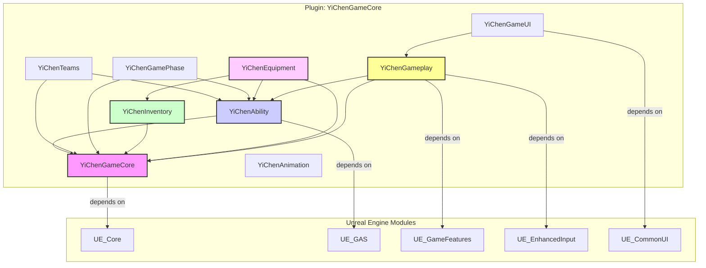

# YiChenGameCore 插件技术架构文档

## 1. 概述

`YiChenGameCore` 是一个为 Unreal Engine 5 设计的高度模块化、可扩展的游戏核心功能插件。其设计目标是提供一套通用的、可复用于多种游戏类型（尤其是多人在线FPS）的基础框架。插件深度整合了 Unreal Engine 5 的核心功能，包括 **Gameplay Ability System (GAS)**、**Enhanced Input**、**Game Features** 和 **Modular Gameplay**，旨在为开发者提供一个坚实、高效且易于扩展的起点。

## 2. 设计理念

- **模块化与高内聚**：插件被划分为多个高内聚、低耦合的独立模块（如 `Inventory`, `Equipment`, `Ability`）。每个模块都专注于解决特定的游戏功能，既可以协同工作，也可以被独立集成到其他项目中。

- **数据驱动**：核心游戏逻辑和对象属性（如物品、技能、装备）通过数据资产（Data Assets）和数据表（Data Tables）进行定义，允许策划和设计师在不修改代码的情况下，快速迭代和调整游戏内容。

- **网络优先**：所有核心功能都从设计之初就考虑了网络同步，采用 Unreal Engine 的复制（Replication）机制和 **FastArraySerializer** 等高效同步方案，确保在多人联机环境下的稳定性和性能。

- **Game Feature 插件化**：鼓励使用 Game Feature 插件来扩展核心功能。例如，针对特定游戏类型（如FPS）的专属功能（如枪械、弹道）应在独立的 Game Feature (`ShooterCore`) 中实现，从而保持核心插件的通用性。

## 3. 模块依赖关系图

## 4. 各模块核心职责

- **`YiChenGameCore`**
  - **职责**: 提供整个插件最基础的工具类、数据结构和基类。它是所有其他模块的依赖核心，负责定义通用的接口和数据类型，如 `FYcGameplayTagStackContainer`（GameplayTag 堆叠容器）和 `UYcReplicableObject`（可复制子对象基类）。

- **`YiChenAbility`**
  - **职责**: 深度集成 GAS，提供自定义的 `UYcAbilitySystemComponent`、`UYcGameplayAbility` 和 `UYcGameplayEffect` 基类。该模块简化了技能的授予、管理和交互逻辑，并提供了标签关系映射等高级功能。

- **`YiChenInventory`**
  - **职责**: 实现了一个通用的、网络同步的库存系统。通过 `FYcInventoryItemDefinition`（物品定义）和 `UYcInventoryItemInstance`（物品实例）的模式，支持高度可扩展的物品功能（Fragment 系统）。

- **`YiChenEquipment`**
  - **职责**: 构建于 `Inventory` 和 `Ability` 模块之上，提供了一套完整的装备系统。它管理着 `UYcEquipmentInstance`（装备实例），并负责处理装备的穿戴/卸下、Actor 的生成/销毁以及相关技能的授予/移除。

- **`YiChenGameplay`**
  - **职责**: 包含高层级的游戏逻辑和框架，是连接各个系统的“胶水层”。它负责管理 `Experience`（游戏体验）、`GameMode`、`PlayerState` 等，并处理玩家的初始化流程和输入绑定。

- **`YiChenTeams`**
  - **职责**: 提供团队管理功能，包括队伍的创建、玩家的分配以及敌我关系的判断（Attitude System）。该模块是实现团队对抗玩法的核心。

- **`YiChenGamePhase`**
  - **职责**: 管理游戏的生命周期和流程，例如大厅、准备阶段、战斗阶段、结算阶段等。它基于 GAS 实现，允许每个阶段拥有独立的 GameplayTag 和逻辑。

- **`YiChenGameUI`**
  - **职责**: 提供了 UI 框架的基础，集成了 CommonUI，并为 HUD、计分板、库存界面等提供了基类和管理逻辑。

- **`YiChenAnimation`**
  - **职责**: 包含动画相关的基类和工具，例如自定义的 `UAnimInstance`，用于解耦动画蓝图和角色状态。

## 5. 改进建议

- **1. 完善文档与示例**
  - **建议**: 为每个模块的核心类和函数补充详细的 Doxygen 注释。同时，创建一个独立的示例项目或 Game Feature，演示如何使用 `YiChenGameCore` 快速搭建一个功能完整的游戏，这将极大地降低新用户的上手门槛。

- **2. 推进 `ShooterCore` Game Feature 的开发**
  - **建议**: 尽快开始 `ShooterCore` 的开发，将所有 FPS 强相关的功能（如枪械、弹道、后坐力、瞄准）从核心插件中剥离出来。这既能验证核心框架的扩展性，也能保持 `YiChenGameCore` 的通用性。

- **3. 引入自动化测试**
  - **建议**: 为核心功能（特别是数据处理和网络同步部分）编写自动化测试用例。这能确保代码变更不会意外破坏现有功能，对于一个计划开源的长期项目来说至关重要。

- **4. 扩展 UI 框架**
  - **建议**: 在 `YiChenGameUI` 中引入更完善的 UI 管理方案，例如基于 `GameplayMessage` 的 UI 刷新机制、统一的 UI 动画和过渡效果、以及更丰富的预制 UI 组件（如血条、弹药显示等）。

- **5. 性能分析与优化**
  - **建议**: 定期使用 Unreal Insights 等工具对插件进行性能分析，特别是在大规模玩家数量的压力测试场景下。重点关注网络带宽、CPU 占用和内存使用，并针对性地进行优化。
